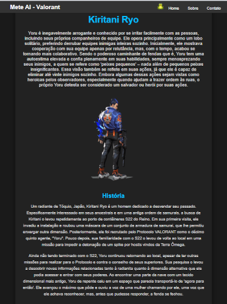

# Valorant Character Abilities

Este é um projeto de site dedicado a descrever as habilidades dos personagens (Agentes) do jogo *Valorant*. O objetivo é criar uma plataforma fácil de usar para que os jogadores possam aprender sobre as habilidades e história de cada agente.

## Funcionalidades

- **Lista de Agentes**: Exibe todos os agentes disponíveis no *Valorant*, divididos por funções (Controller, Duelist, Initiator, Sentinel).
- **Detalhes das Habilidades**: Cada agente possui uma página dedicada com uma descrição detalhada de suas habilidades, incluindo efeitos e como utilizá-las.
- **Design Responsivo**: O site foi desenvolvido para ser acessível em dispositivos móveis, garantindo uma boa experiência para todos os jogadores.

## Tecnologias Utilizadas

- **HTML5**: Para a estruturação da página.
- **CSS3**: Para o estilo e layout do site.
- **JavaScript**: Para interatividade e dinâmica de elementos.

## Como Usar

1. Baixe o centeúdo desse repositório:
   você baixar apertando no disquete [\u1F4BE](https://github.com/Pedro-kiwi/Site-bacana1/archive/refs/heads/main.zip)

2. Navegue até a pasta do projeto:
   
3. Abra o arquivo 'index.html'